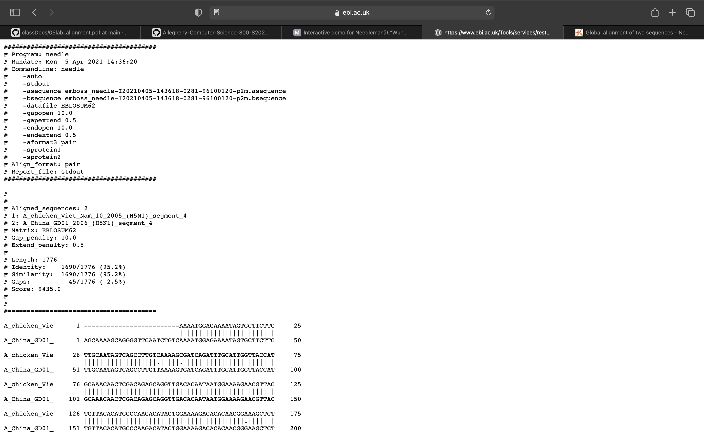
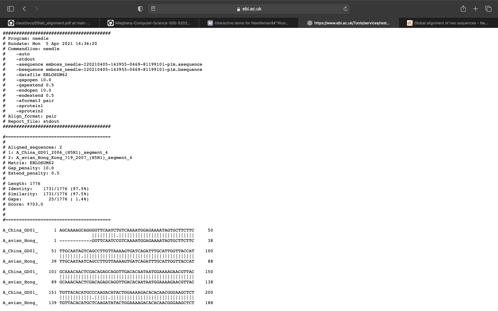

#### Name: Thomas Antle
#### Date: 05 April 2021
#### What this is: Questions in blue from the assignment sheet.

#### Part 1.

 1. Which software did you use to conduct your analysis?

I used the online interactive demo software.

 2. How similar were the two sequences (`s1.fasta` and `s2.fasta`) which you applied an alignment program?

The two sequences were fairly similar. Based on the results, I think they would have around a 60-80% similarity. This is not great compared to others with similarities in the 90% and above range, but it is fairly similar.

 3. Are the two sequences closely related to each other, in your opinion?

In my opinion, the two sequences may be related, but not very closely related to each other.

 4. What proof do you have to suggest such a claim?

x

#### Part 2
 1. How much similarity exists between each of the sequences to the others?

There is a alot of similarity between each of the sequences to the others. The China sequence and chicken sequence have a 95.2% similarity. The China sequence and avian sequence have a 97.5% similarity. Also, the chicken sequence and avian sequence have a 96% similarity.

 2. Based on your results so far (which are too few to provide a comprehensive study), do you believe there is evidence that human adaptation is occurring in H5N1 viruses that might merit concern about human-to-human transmission in the near future?

Based on the results so far, I do not believe that there is evidence that human adaptation is occuring in H5N1 viruses that might merit concern about human-to-human transmission in the near future. Considering the similarity percentages of all of the sequences compared to each other, all of the sequences are very similar. Given that the least similar allignment (chicken v China) is very high at a 95.2% similarity, I do not think that this is enough difference to merit concern. Though, I do not possess the knowledge to truly know if 5% difference may be detrimental in this case.

 3. Statistics: What were the numbers of Lengths, Similarities, Gaps and Scores for each of your alignment tasks?

The allignment between the chicken sequence and the avian sequence yielded: 

- Length: 1751
- Similarity: 1681/1751 (96.0%)
- Gaps: 20/1751 (1.1%)
- Score: 9379.0

The allignment between the China sequence and the avian sequence yielded:

- Length: 1776
- Similarity: 1731/1776 (97.5%)
- Gaps: 25/1776 (1.4%)
- Score: 9703.0

The allignment between the chicken sequence and the China sequence yielded:

- Length: 1776
- Similarity: 1690/1776 (95.2%)
- Gaps: 45/1776 (2.5%)
- Score: 9435.0

Chicken v Avian ^

Chicken v China ^

China v Avian ^

(Did you remember to add your name to this Markdown file?)
